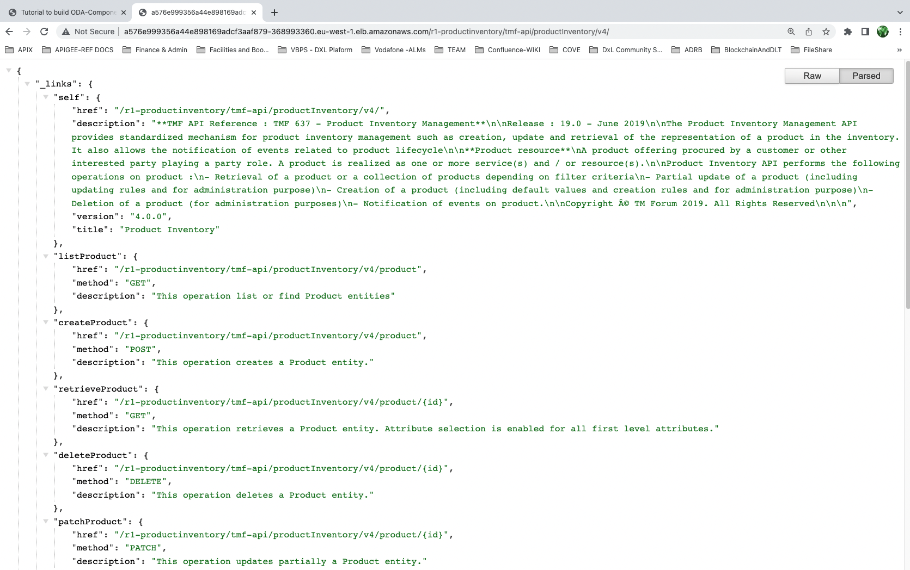
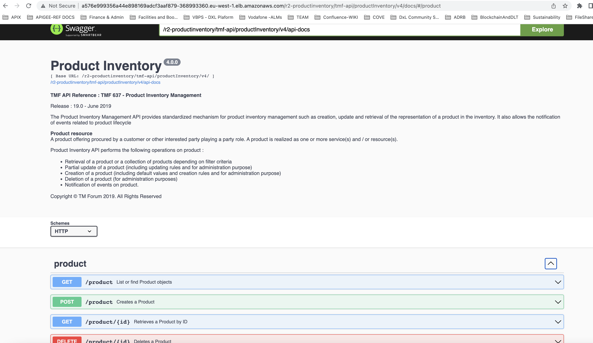

## Tutorial to build ODA-Component from Open-API Reference Implemenation

This tutorial shows the complete process to package, test and deploy an ODA-Component, using the nodejs reference implementation of the TMF620 Product Catalog Management API as the source code. You should be able to follow the process below using an existing software application as source (the process should work for simple applications - it is intended as a tutorial to get you started; For more complex applications you may have to decompose to multiple containers/micro-services and even multiple ODA-Components).

For an introdution to the Open-Digital Architecture component model, take a look at the recording from the Digital Transformation World Series conference:


[DTW World Series Masterclass](https://www.youtube.com/watch?v=e_m-nnKvWIs)


### 1. Download Reference Implementation

Download Reference Implementation from [https://projects.tmforum.org/wiki/display/API/Open+API+Table](https://projects.tmforum.org/wiki/display/API/Open+API+Table).


### 2. (optionally) test locally with local MongoDb.

In the `utils/mongoUtils.js` file, you will need to replace the connectHelper with a helper function that uses local connection string:

```
/* connection helper for running MongoDb from url */
function connectHelper(callback) {

  var credentials_uri = "mongodb://localhost:27017/tmf";
  let options = {
    useNewUrlParser: true 
  };
  MongoClient.connect(credentials_uri, options, function (err, db) {
    if (err) {
      mongodb = null;
      callback(err,null);
    } else {
      mongodb = db.db("tmf");
      callback(null,mongodb);
    }
  });
}
```


## 3. Configure mongoDb connection url to use within Kubernetes.

In the `utils/mongoUtils.js` file, you will need to update the local connection string to a url that wil work within Kubernetes (this will match the kubernetes service name for mongoDb). Note we include a release name passed as an environment variable (as we could potentially deploy multiple instances of a component in the same canvas).

```
/* connection helper for running MongoDb from url */
function connectHelper(callback) {
  var releaseName = process.env.RELEASE_NAME; // Release name from Helm deployment
  var credentials_uri = "mongodb://" + releaseName + "-mongodb:27017/tmf";
  let options = {
    useNewUrlParser: true 
  };
  MongoClient.connect(credentials_uri, options, function (err, db) {
    if (err) {
      mongodb = null;
      callback(err,null);
    } else {
      mongodb = db.db("tmf");
      callback(null,mongodb);
    }
  });
}
```


## 4. Package the nodejs implementation into a docker image

Create a dockerfile with the instructions to build our image. We are starting with the official [node](https://hub.docker.com/_/node) docker image.

```
FROM node
```

This image comes with Node.js and NPM already installed so the next thing we need to do is to install the app dependencies.

```
COPY implementation/package*.json .
RUN npm install
```

Then we copy the source code.

```
COPY implementation ./
```

The app binds to port 8080 so we'll use the EXPOSE instruction to have it mapped by the docker daemon:

```
EXPOSE 8080
```

Finally we define the command that will run the app.

```
CMD ["node", "index.js"]
```


The complete dockerfile should look like:

```
FROM node
COPY implementation/package*.json .
RUN npm install
COPY implementation ./
EXPOSE 8080
CMD ["node", "index.js"]
```

Before we build this dockerfile, we create a `.dockerignore` file (so the at node_modules packages are not copied into the docker image - this would make the image very large. The `RUN npm install` command inside the dockerfile will install these on demand).

```
node_modules
npm-debug.log
```

To build the docker image, we use the command:

```
docker build -t lesterthomas/productcatalogapi:0.1 -t lesterthomas/productcatalogapi:latest -f dockerfile .
```

Note: we use the -t to tag the image. We give the image two tags, one with a version number and the other with a `latest` tag that will overwrite any previously uploaded images.

Finally we upload the docker image to a Docker repository. I'm using the default [DockerHub](https://hub.docker.com) with an account `lesterthomas` that I have created previously. If this is the first time accessing the docker repository you will need to login first with the `docker login` command.

```
docker push lesterthomas/productcatalogapi --all-tags
```


## 5. Create Component Envelope 

The Component Envelope contains the meta-data required to automatically deploy and manage the component in an ODA-Canvas environment. The envelope will contain meta-data about the standard Kubernetes resources, as well as the TM Forum ODA extensions. There is a detailed breakdown of the Component Envelope in [ODAComponentDesignGuidelines](https://github.com/tmforum-oda/oda-ca-docs/blob/master/ODAComponentDesignGuidelines.md).


We will use [Helm](https://helm.sh/) to create the component envelope as a Helm-Chart. This tutorial assumes you have already installed Helm on your local environment.

The first step is to use `helm create <chartname>' which creates a boiler-plate chart:

```
helm create productcatalog
```

The boiler-plate should be visible under the productcatalog folder. It contains a `Chart.yaml` (with meta-data about the chart) and a `values.yaml` (where we put any default parameters that we want to use). It also contains a `charts/` folder (empty) and a `templates/` folder (contining some boiler-plate Kubernetes templates).

The `Chart.yaml` will look something like the code below - no changes are required.

```
apiVersion: v2
name: productcatalog
description: A Helm chart for Kubernetes

# A chart can be either an 'application' or a 'library' chart.
#
# Application charts are a collection of templates that can be packaged into versioned archives
# to be deployed.
#
# Library charts provide useful utilities or functions for the chart developer. They're included as
# a dependency of application charts to inject those utilities and functions into the rendering
# pipeline. Library charts do not define any templates and therefore cannot be deployed.
type: application

# This is the chart version. This version number should be incremented each time you make changes
# to the chart and its templates, including the app version.
# Versions are expected to follow Semantic Versioning (https://semver.org/)
version: 0.1.0

# This is the version number of the application being deployed. This version number should be
# incremented each time you make changes to the application. Versions are not expected to
# follow Semantic Versioning. They should reflect the version the application is using.
# It is recommended to use it with quotes.
appVersion: "1.16.0"
```


The `values.yaml` file contains some sample parameters that are used in the template samples. Where you see a parameter in curly brackets in the templates file (e.g. `{{ .Values.replicaCount }}`) - this will insert the value `replicaCount` from the values file into the template.

The `Charts/` folder lets you include existing Helm charts into your new chart - for example, we could include one of the standard MongoDb Helm charts (which would support a high-availability multi-node MongoDb deployment, for example). For simplicity during this tutorial we will leave `Charts/` empty.

Funally, most of the details we will create are in the `templates/` folder. Take a look inside this folder and you will see multiple sample templates:

```
deployment.yaml  
hpa.yaml  
ingress.yaml  
serviceaccount.yaml  
service.yaml
```

For our Product Catalog component, we will create two deployments (one for the nodejs container that implements the API, and one for the mongoDb).

Delete the the `deployment.yaml` template and create two new templates called `deployment-productcatalogapi.yaml` and the other `deployment-mongodb.yaml`.

Copy the code below into  `deployment-productcatalogapi.yaml`. I've chosen to only parameterise the `component.type` field (a production heml chart would typically parameterize many more values). The file also uses the `Release.Name` which is the name given to the instance of the component when deployed by Helm (we could potenticlly deploy multiple instanaces in the same ODA-Canvas). Note that we also pass the release name and component name as environment variables into the container.

```
apiVersion: apps/v1
kind: Deployment
metadata:
  name: {{.Release.Name}}-productcatalogapi
  labels:
    oda.tmforum.org/componentName: {{.Release.Name}}-{{.Values.component.type}}
spec:
  replicas: 1
  selector:
    matchLabels:
      app: {{.Release.Name}}-productcatalogapi
  template:
    metadata:
      labels:
        app: {{.Release.Name}}-productcatalogapi
    spec:
      containers:
      - name: {{.Release.Name}}-productcatalogapi
        env:
        - name: RELEASE_NAME
          value: {{.Release.Name}}           
        - name: COMPONENT_NAME
          value: {{.Release.Name}}-{{.Values.component.type}}           
        image: lesterthomas/productcatalogapi:latest
        ports:
        - name: {{.Release.Name}}-productcatalogapi
          containerPort: 8080
```


We also need to deploy a mongoDb. We will use the standard mongoDb image from dockerhub.


```
apiVersion: apps/v1
kind: Deployment
metadata:
  name: {{.Release.Name}}-mongodb
  labels:
    oda.tmforum.org/componentName: {{.Release.Name}}-{{.Values.component.type}}
    app: {{.Release.Name}}-mongodb
spec:
  replicas: 1
  selector:
    matchLabels:
      app: {{.Release.Name}}-mongodb
  template:
    metadata:
      labels:
        app: {{.Release.Name}}-mongodb
    spec:
      containers:
      - name: {{.Release.Name}}-mongodb
        image: mongo:latest
        ports:
        - name: {{.Release.Name}}-mongodb
          containerPort: 27017
        volumeMounts:
        - name: {{.Release.Name}}-mongodb-pv-storage
          mountPath: "/data/db"
      volumes:
      - name: {{.Release.Name}}-mongodb-pv-storage
        persistentVolumeClaim:
          claimName: {{.Release.Name}}-mongodb-pv-claim
```

The mongoDb requires a persistentVolume and so we create a persistentVolumeClaim template `persistentVolumeClaim-mongodb.yaml`. 


```
kind: PersistentVolumeClaim
apiVersion: v1
metadata:
  name: {{.Release.Name}}-mongodb-pv-claim
  labels:
    oda.tmforum.org/componentName: {{.Release.Name}}-{{.Values.component.type}}
spec:
  accessModes:
  - ReadWriteOnce
  resources:
    requests:
      storage: 5Gi 
```


We need to make the mongoDb available to the nodejs productcatalogapi image, so we create a Kubernetes Service resource in `service-mongodb.yaml`. Note the service matches the connection url we created in step 3.


```
apiVersion: v1
kind: Service
metadata:
  name: mongodb
  labels:
    oda.tmforum.org/componentName: productcatalog
    app: mongodb
spec:
  ports:
  - port: 27017
    targetPort: mongodb
    name: mongodb
  type: NodePort
  selector:
    app: mongodb
```

We need to expose the product catalog API using a Service as well in `service-productcatalogapi.yaml`.

```
apiVersion: v1
kind: Service
metadata:
  name: {{.Release.Name}}-productcatalogapi
  labels:
    app: {{.Release.Name}}-productcatalogapi
    oda.tmforum.org/componentName: {{.Release.Name}}-{{.Values.component.type}}
spec:
  ports:
  - port: 8080
    targetPort: {{.Release.Name}}-productcatalogapi
    name: {{.Release.Name}}-productcatalogapi
  type: NodePort
  selector:
    app: {{.Release.Name}}-productcatalogapi
```


We have created all the Kubernetes resources to deploy the mongoDb and productcatalog nodejs containers and expose as services. The final step is to add the ODA-Component meta-data. This meta-data will be used at run-time to configure the canvas services. Create the code below in `component-productcatalog.yaml`.

This is a relatively simple component that just exposes one API as part of its `coreFunction`. Note that we have included the release name and component name in the root of the AI path (this is a good pattern to follow so that the API doesn't conflict with any other components deployed in the same environment).

```
apiVersion: oda.tmforum.org/v1alpha1
kind: component
metadata:
  name: {{.Release.Name}}-{{.Values.component.type}}
  labels:
    oda.tmforum.org/componentName: {{.Release.Name}}-{{.Values.component.type}}
spec:
  type: {{.Values.component.type}}
  selector:
    matchLabels:
     oda.tmforum.org/componentName: {{.Release.Name}}-{{.Values.component.type}}
  componentKinds:
    - group: core
      kind: Service    
    - group: core
      kind: PersistentVolumeClaim
    - group: apps
      kind: Deployment  
  version: "0.0.1"
  description: "Simple Product Catalog ODA-Component from Open-API reference implementation." 
  maintainers:
    - name: Lester Thomas
      email: lester.thomas@vodafone.com
  owners:
    - name: Lester Thomas
      email: lester.thomas@vodafone.com     
  coreFunction:
    exposedAPIs: 
    - name: productcatalogmanagement
      specification: https://raw.githubusercontent.com/tmforum-apis/TMF620_ProductCatalog/master/TMF620-ProductCatalog-v4.0.0.swagger.json
      implementation: {{.Release.Name}}-productcatalogapi
      path: /{{.Release.Name}}-{{.Values.component.type}}/tmf-api/productCatalogManagement/v4
      developerUI: /{{.Release.Name}}-{{.Values.component.type}}/tmf-api/productCatalogManagement/v4
      port: 8080
    dependantAPIs: []
  eventNotification:
    publishedEvents: []
    subscribedEvents: []
  management: []
  security:
    securitySchemes: []
```

Finally we have to create the parameters in the `values.yaml` file. Since we have parameterized just 1 value, our values.yaml file will look like:

```
# Default values for productcatalog.
# This is a YAML-formatted file.
# Declare variables to be passed into your templates.


component:
  # Specifies whether a service account should be created
  type: productcatalog
```

## 6. Test component envelope using component CTK


The CTK will operate against an instance of the component. We can generate a kubernetes manifest of an instance using the `helm template [instance namme] [chart]` command. We can take the output of this command into a temporary file:

```
helm template test productcatalog > test-instance.component.yaml
```

If you examine the test-instance.component.yaml you will see all the kubernetes resources (deployments, services, persistentVolumeClaim) as well as a component resource. All the resources are labelled as belonging to the component. Also the component describes its core function (exposing a single API).

We can test that this component instance conforms to the ODA-Component standard by using the component CTK: Download the ODA-Component CTK from [https://github.com/tmforum-oda/oda-component-ctk/](https://github.com/tmforum-oda/oda-component-ctk/).


Within the opa-component-ctk folder, install the ctk.

```
npm install
```

Then run the ctk against the component envelope.

```
npm start ../oda-ca-docs/ODA-Component-Tutorial/test-instance.component.yaml
```

You shold get an output like the image below. If you receive any errors, fix the issue in the helm chart yaml file and try again.


## 7. Deploy the component envelope into Open Digital Lab canvas


Connect to the Open Digital Lab: Get the kubectl config from the rancher environment at https://rke.tmforum.org/c/c-85kcq/monitoring - click the Kubeconfig File button in the top right:


Copy this into your `~/.kube/config` file.

You can test the connection using `kubectl get all --namespace components`. (You should either see a message `No resources found in components namespace.` or you may retrieve a list of kubernetes resources).

To permanently save the namespace for all subsequent kubectl commands use:

```
kubectl config set-context --current --namespace=components
```

Install the component using Helm:

```
helm install test productcatalog/ --namespace components
```

You can then view the component in `kubectl`:

```
kubectl get components
``

The `kubectl get components` will show all the deployed components including the details of exposed apis and a developer-ui (if supplied). Initially these details will be blank - the component may take a few seconds to fully deploy. Once deployed, it should look like:


If you navigate to the root or the API (in a web browser or in postman), you should see the entrypoint of the API:



If you navigate to the developer-ui, you shold see the swagger-ui tool:




## ISSUES & resolution

1. Kubernetes ingress expect a 200 response at the root of the API. Without this, they do not create an ingress and instead return a 503 error. I've created an additional 'entrypoint' middleware hook in the index.js. This returns an entrypoint (or homepage) response for the API (following the TMF630 Design Guidelines).

```
  // create an entrypoint
  console.log('app.use entrypoint');
  app.use(swaggerDoc.basePath, entrypointUtils.entrypoint);
```

2. Due to a node version issue (i think!) the generated API RI does not work on the latest v15 of node. I have created container based on node v10. The issue is with the fs.copyFileSync function: The v15 expects the third parameter to be an optional `mode` whilst the current implementation has a call-back error function.
3. api-docs are exposed at /api-docs which means that you cant host multiple apis on the same server. I've moved to host them at /tmf-api/productCatalogManagement/v4/api-docs instead (and the swagger-ui at /tmf-api/productCatalogManagement/v4/docs).
4. MongoDb url in productcatalogapi image needs to include the Release Name (for the instance of the component) - pass this as an Environment variable.
5. I've included the component name in the root of the API (so that you can deploy multiple instances of the API in the same server). For a Helm install with release name test, the api is deployed at: /test-productcatalog/tmf-api/productCatalogManagement/v4/