## Tutorial to observe a running component using Observability framework

This tutorial shows the process to deploy the reference example ODA Component into the TM Forum Open Digital Lab environment and observe the traffic, performance and business metrics.

The pre-requisites for this tuturial is a PC/Mac/Linux machine with `kubectl` and `helm` installed and access to the TM Forum Open Digital Lab at https://rke.tmforum.org/ 

There is a video of this tutorial at: [ODA Observability Video walkthrough](https://youtu.be/XEbjc4g_usM)


### Reference Implementation environment with Service Mesh

We will be using the TM Forum Open Digital Lab Reference Implementation (see below).

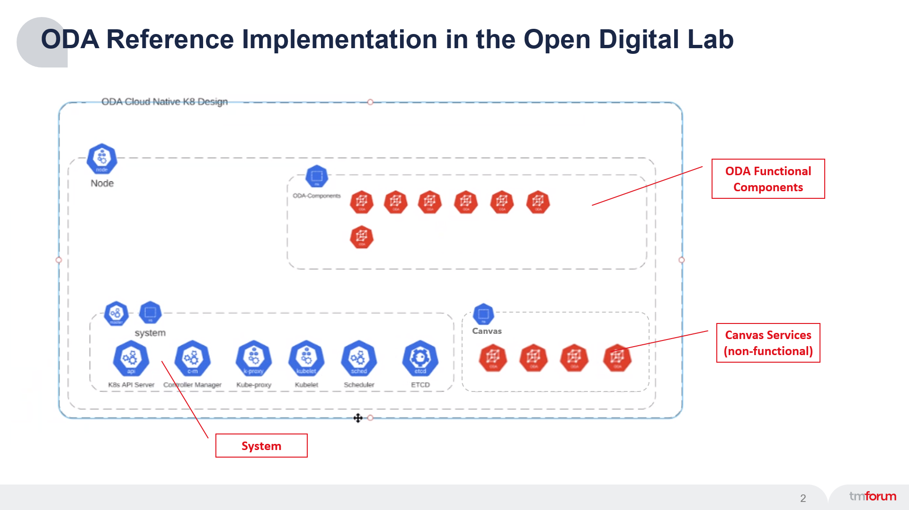

The foundation of the Reference Implementation consists is a Kubernetes Cluster (system). On top of this the ODA-Component Accelerator team has deployed a set of non-functional Canvas services. During this tutorial we will deploy the example functional component and use the canvas services to observe the traffic, performance and business metrics for this component.

The diagram below is a zoomed-in picture of the Cavvas services.

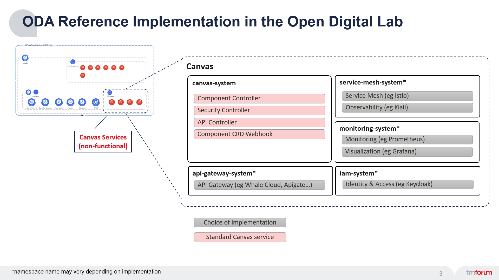

The observability is provided by a Service Mesh, which provides a control-plane over the top of Kubernetes and allows you to trace and monitor all traffic into and out of the running services. In the Reference Implementation we are using the Istio Service Mesh, but other canvas deployments could use alternative Service Meshes (with a corresponding controller).

To visualise the data provided by the Service Mesh, we will use Kiali which is a management console for Istio. Again, other Canvas deployments could use alternative tools.

## Deploying the component

We will be using the reference example component provided as part of the Reference Implementation. It is available at `https://github.com/tmforum-oda/oda-ca-docs/example/ProductCatalog`.

* Step 1. Clone the `https://github.com/tmforum-oda/oda-ca-docs` repository and navigate to the `/examples/ProductCatalog` folder.

* Step 2. Configure `kubectl` for the `oda-ca-cluster2`: Navigate to the Rancher environment at https://rke.tmforum.org/, select the `oda-ca-cluster2` and use the Kubeconfig file in the top-right.

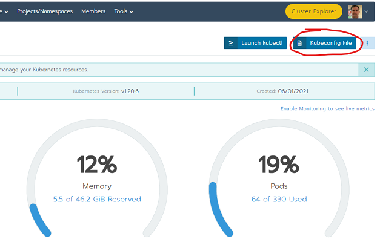

* Step 3. Deploy the reference implementation example component using helm:

```
helm install r1 .\productcatalog\ -n components
```

This will install the `productcatalog` example component in the `components` namespace. 

* Step 4: View the component in Kiali

To navigate to the Kiali management console, click the `Cluster Explorer` button at the top of the Rancher console: This opens-up the new Rancher User Interface.

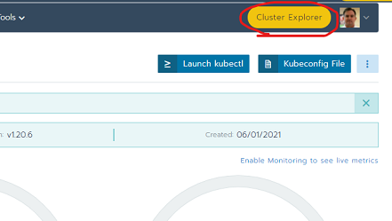

Then navigate to Istio by clicking the `Cluster Explorer` drop-down in the top-left and click on `Istio`.

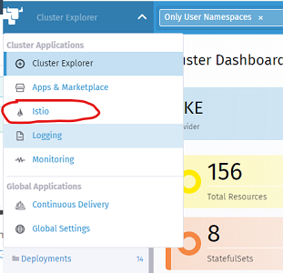

Finally, click on the `Kiali` link

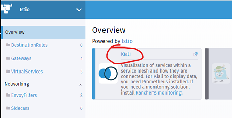


This should show the Kiali Management Console. Click the `Graph` link on the left-hand-side.

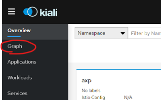


You should be able to see the `r1-productcatalog` component in the Kiali interface:


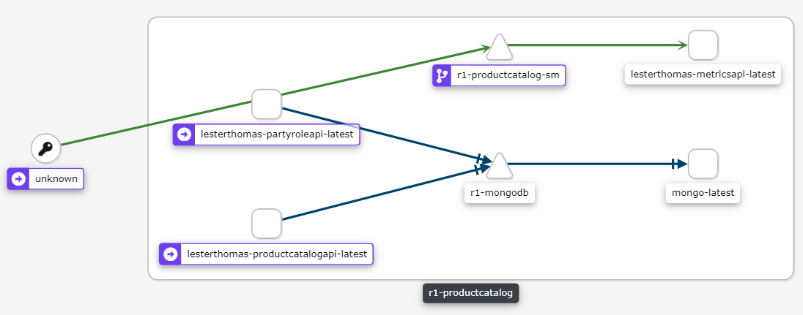

This view shows what is going on inside the Kubernetes cluster. If you click on any of the links, you can observe the traffic patterns. For HTTP traffic, you can see whether the response was OK (2xx), Redirect (3xx), Client errors (4xx) or server errors (5xx).

So far, we haven't sent any traffic to this component - the data you are seeing was generated as part of the initialization of the component.

To generate some traffic, you could use tools such as [Postman](https://www.postman.com/)  or [Curl](https://curl.se/). We can query the URL of the API endpoints by using `kubectl` and querying the API custom resource (api.oda.tmforum.org) that is part of the Canvas:

```
kubectl get api -n components
``` 

If we take the Endpoint for the party-role API and for the product-catalog API, we can generate some traffic using CURL:

```
CURL "http://a576e999356a44e898169adcf3aaf879-368993360.eu-west-1.elb.amazonaws.com/r1-productcatalog/tmf-api/partyRoleManagement/v4/partyRole"

CURL "http://a576e999356a44e898169adcf3aaf879-368993360.eu-west-1.elb.amazonaws.com/r1-productcatalog/tmf-api/productCatalogManagement/v4/catalog"
```

The Kiali interface will change, since new traffic flows are being exercised. (For now, ignore the traffic from 'Unknown' - this is the monitoring system itself creating traffice - we will cover this later.)


I will use Postman to run a large number of calls to the product catalog API. The Kiali interface will show some graphs of traffic requests/min and HTTP response time. (It also shows a 100% success rate).

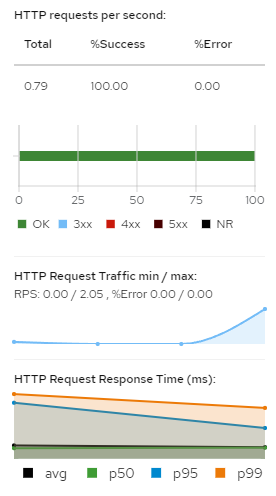

It can show the success or failure of the HTTP requests. To test this, I'll intentionally send a request for a resource that does not exist:

```
CURL "http://a576e999356a44e898169adcf3aaf879-368993360.eu-west-1.elb.amazonaws.com/r1-productcatalog/tmf-api/productCatalogManagement/v4/catalog/xxxxxxx"
```

The Kiali interface will show the HTTP response, with some 4xx (client error) responses.

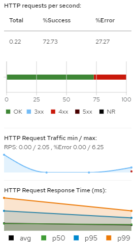

We have so far shown the 'out-of-the-box' observability we get from the Service Mesh that is part of the ODA-Canvas. The question is, **how does this work?** and **can I extend this to get more custom business metrics from the component?**.

### How does this work?

The Service Mesh works by 'injecting' an [Envoy proxy](https://www.envoyproxy.io/) container into every pod in the monitored namespace. For the Istio Service Mesh, you indicate which namespaces you want it to manage by adding the `istio-injection: enabled` label to the namespace. The Envoy container will proxy all traffic into and out of the pod; It allows you to set policy rules to control the traffic. It also measures all the traffic and puts this data into a [Prometheus](https://prometheus.io/) time-series database. (Technically, the Prometheus database 'scrapes' the metrics data from Envoy).

We can see the running `pods` in the `components` namespace with the command:

```
kubectl get pods -n components
```


We can see the containers running in a particular pod with the command:
```
kubectl get pods [insert pod name from query above] -o jsonpath='{.spec.containers[*].name}'
```


You can see there is an istio-proxy container running in our Pod - this was not part of our Component deployment, but was 'injected' by Istio automatically.

The diagram below shows the Monitoring Architecture:


You can see the targets that Prometheus scrapes by clicking on the `Monitoring` link in the Rancher Cluster Manager:

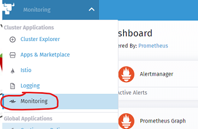

And then clicking on the `Prometheus Targets` link. The picture below shows all the targets that Prometheus is scraping, including the istio-system/envoy.

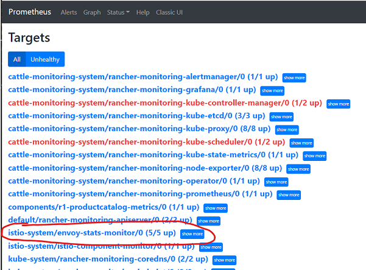


The Envoy Proxy controls all traffic into the pod: In the ODA-Canvas we have a `component operator` that automatically configures Istio to allow traffic where the [Component Envelope Specification](../ODAComponentDesignGuidelines.md) defines an API Endpoint. (Technically, the `component operator` creates Istio `Virtual Service` custom resources see [API Operator for Istio](https://github.com/tmforum-oda/oda-ca/tree/master/controllers/apiOperatorIstio) )


I can view these metrics directly in Prometheus - it has a very simple query interface on top of its time-series database. For example, try:
```
rate(container_cpu_usage_seconds_total[10m])
```

or 

```
istio_requests_total {destination_service_name="r1-partyroleapi"}
```

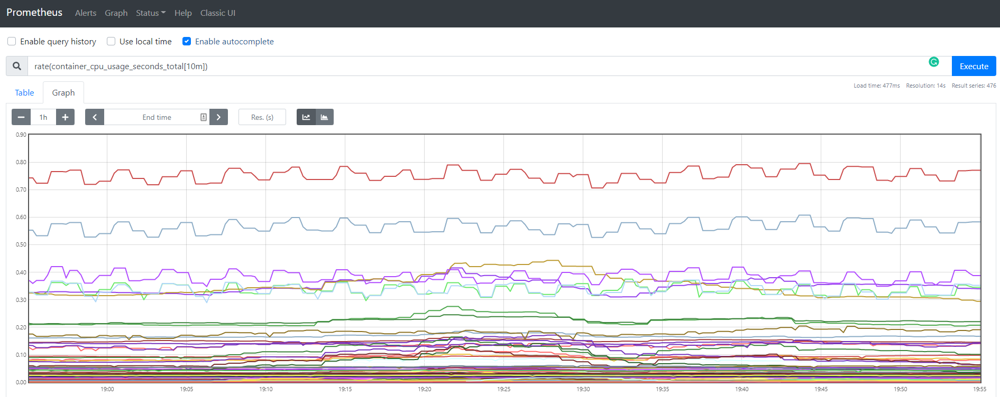

## How do I extend this to get custom business metrics from the component?

It is possible for a component to create business metrics, to allow you to see business operations that are occuring within a component. Prometheus supports a number of Metric Types:

A **counter** is a cumulative metric that represents a single monotonically increasing counter whose value can only increase or be reset to zero on restart. For example, you can use a counter to represent the number of requests served, tasks completed, or errors."

A **gauge** is a metric that represents a single numerical value that can arbitrarily go up and down. Gauges are typically used for measured values like [CPU] or current memory usage, but also 'counts' that can go up and down, like the number of concurrent requests."

A **histogram** samples observations (usually things like request durations or response sizes) and counts them in configurable buckets. It also provides a sum of all observed values."

(*there is also a summary metric that has effectively been replaced by histogram)


To expose business metrics, a component needs to define a `/metrics` endpoint that exposes this data following the Prometheus standard. In the reference example component, we added a `Metrics microservice` that registers for changes within the Product Catalog (using the Open-API Pub/Sub mechanism) and then exposes this data as a Prometheus metrics API.

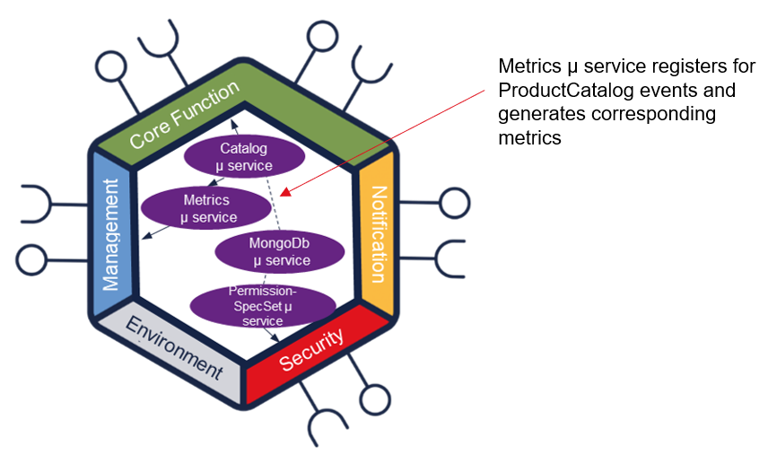

The code for the reference example component can be found at: [Example metrics](https://github.com/tmforum-oda/oda-ca-docs/blob/master/examples/ProductCatalog/registerAllEventsMicroservice/index.js). This is built using nodeJS and uses the `prom-client` Prometheus client library for nodeJS (there are client libraries for most popular programming libraries).

**How do you configure Prometheus to scrape this endpoint?** 

To configure Prometheus to scrape this endpoint, simply add the end-point into the Component Envelope YAML file in the `Management` section.

```
  management: 
    - name: metrics
      apitype: prometheus
      implementation: <reference to a Kubernetes Service for the metrics micro-service>
      path: /<path where the metrics endopint is available>
      port: <port where the endpoint is available>  
```

See the example at [Example Component Envelope](https://github.com/tmforum-oda/oda-ca-docs/blob/master/examples/ProductCatalog/productcatalog/templates/component-productcatalog.yaml).


When you deploy this componet, you can check it appears in the Prometheus scraping targets: 

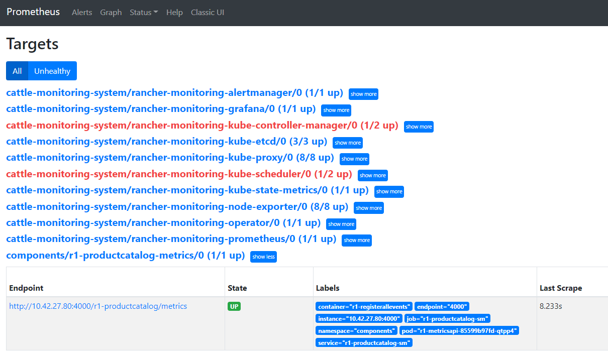

You could build a custom dashboard for these metrics using a tool such as [Grafana](https://grafana.com/). For a simple User Interface you can view the built-in Graph query in Prometheus. In the picture below we are querying the rate of the product_catalog_api_counter over a 10m period. 

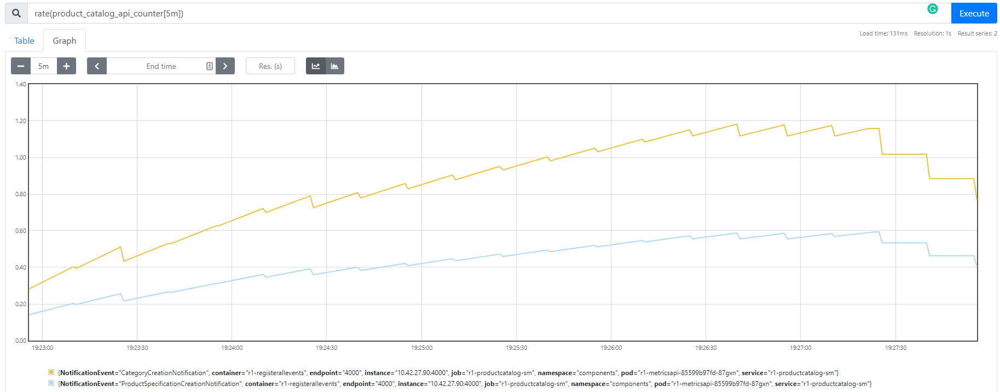
