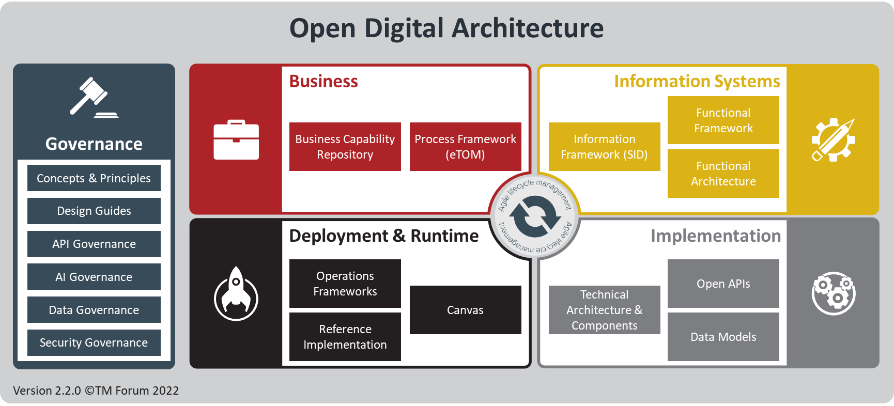

# Introduction to the ODA Component Accelerator Project (ODA-CA)

**The Open Digital Architecture**

ODA is an enterprise architecture blueprint for modular, cloud native open digital platforms that can be orchestrated using AI.  It is being developed and maintained by members of [TM Forum](https://www.tmforum.org/).  You can start learning about ODA [here](https://www.tmforum.org/oda/).

[ODA Components](https://www.tmforum.org/oda/implementation/technical-architecture-components/) are part of the *Implementation* quadrant of the ODA. They are  standardized, reusable, microservices-based software building blocks of ODA, connected via [Open APIs](https://www.tmforum.org/oda/implementation/open-apis/). ODA Components are deployed onto an [ODA Canvas](https://www.tmforum.org/oda/deployment-runtime/oda-canvas/), which is in the *Deployment & Runtime* quadrant of the ODA. The Canvas provides a standardized execution platform aligning to Site Reliability Engineering practices.

**Check if your company is already involved in developing ODA**

If your company is a TM Forum member (check [here](https://www.tmforum.org/membership/current-members/)), you can join the ODA collaboration projects [here](https://myaccount.tmforum.org/joinproject) to contribute to ODA and influence its development.

If your company has signed the [ODA manifesto](https://www.tmforum.org/oda/open-digital-architecture-open-api-manifesto/), then it is already committed to ODA's design principles and essential standards to enable a truly ‘plug and play’ set of technology capabilities.

**The ODA-CA project**
 
The ODA Component Accelerator (ODA-CA) is a practical project run by TM Forum member companies in our Open Digital Lab environment. The aims are:

* Collaborative development of the ODA Canvas and ODA Reference Implementation(s) in order to validate ODA in real world applications
* Building a test environment and tooling to validate vendors' commercial products for conformance to the ODA Component specifications
* Developing best practices for deployment of ODA Components and the ODA Canvas 
* Accelerating the ODA standards by contributing practical implementation experience back into the standardization process

Since the project [started in December 2020](https://www.tmforum.org/press-and-news/leading-telecoms-companies-collaborating-to-build-market-for-plug-and-play-software/) we have:

* Built a reference ODA Canvas in our Open Digital Lab based on Kubernetes infrastructure
* Delivered a prototype Component CTK which validates security and functional aspects of ODA Components using a 3-stage test platform in the Open Digital Lab
* Deployed a number of commercial applications onto the reference Canvas and validated them with the prototype Component CTK
* Demonstrated deployment patterns for security and observability use cases
* Built a ‘click-to-deploy’ reference Canvas for TM Forum members to use

Read [this presentation](https://github.com/tmforum-oda/oda-ca-docs/blob/master/Presentations/TM%20Forum%20ODA%20Component%20Accelerator%20Briefing%20v29.pptx?raw=true) (updated Nov 2022) for more details about the ODA-CA project.  If you're interested in joining, please email [accelerator@tmforum.org](mailto:accelerator@tmforum.org).

**DTW23 demos**

* Demo of ODA Component and Canvas conformance testing (from DTW23): [video (13 min)](https://iframe.dacast.com/vod/9292f2e21c51139fb9b2ffd6080ab1d6/898cb729-6d0a-4d95-a5ce-175bf5735afa)
* Deploying and validating a Resource Inventory component on China Mobile's public cloud ODA Canvas: [video (5 min)](https://iframe.dacast.com/vod/9292f2e21c51139fb9b2ffd6080ab1d6/3d3c4c71-001f-4a8c-893d-01b3dc67e38f)
* Validation of an ODA Canvas using the prototype Canvas CTK, showing BDD: [video (5 min)](https://www.youtube.com/watch?v=UofZbT26ITg)
* Deploying and validating an Ericsson Product Inventory component: [video (2 min)](https://iframe.dacast.com/vod/9292f2e21c51139fb9b2ffd6080ab1d6/65360140-2147-4f40-b8c1-bbdf3ca5181c)
* [Clickable example Component CTK report](https://oda-documents.s3.eu-west-2.amazonaws.com/report/index.html)

**Earlier demo videos**

* Using an ODA Proxy Component for SaaS integration and other use cases: [video (8 min)](https://iframe.dacast.com/vod/9292f2e21c51139fb9b2ffd6080ab1d6/da785452-1aea-4e56-b9f6-39cfd2deb717)
* Implementing identity & access management with the ODA Canvas: [video (4 min)](https://www.youtube.com/watch?v=7VKT_kCYfzE)
* Implementing observability with the ODA Canvas: [video (8 min)](https://www.youtube.com/watch?v=5De54QwrvEM&t=2s)
* Deploying ODA Components on the ODA Canvas - API exposure and discovery: [video (6 min)](https://www.youtube.com/watch?v=e63FGHMeI1M)
* Validation of an ODA Component using the prototype Component CTK: [video (3 min)](https://www.youtube.com/watch?v=RyTGzc4pv64&t=1s)

**Deploying Cloud Native Network Functions onto the ODA Canvas**
 
* [Deployment of a CNF to an ODA Canvas running on two different cloud environments](https://github.com/tmforum-oda/oda-ca-docs/blob/master/DTW_Presentations/Whale%20Cloud%20Multi-cloud%20CNF%20deployment%20with%20the%20ODA%20Canvas%20DTW-22.pptx?raw=true). The Canvas standardizes the environment to enable plug-and-play deployment on different cloud platforms (by Whale Cloud, [3 min demo video here](https://iframe.dacast.com/vod/9292f2e21c51139fb9b2ffd6080ab1d6/ecb75692-55a4-2796-7f0a-710ad118b190))
* [Deployment of PCRF (4G) and PCF (5G) onto the same ODA Canvas](https://github.com/tmforum-oda/oda-ca-docs/blob/master/DTW_Presentations/STL_Digital_BSS_Components_Architecture_with_ODA_Canvas.pdf?raw=true), making 4G->5G upgrades and other use cases easy to achieve (by Sterlite, [5 min demo video here)](https://www.tmforum.org/stl-oda-components/)

**Current ODA-CA project members**

alvatross by SATEC, Axiata Digital Labs, China Mobile, Ericsson, Global Wavenet, Hansen Technologies, Inetum, Microsoft, Oracle, Orange, OryxGateway, Sysbiz Technologies, Vodafone, Whale Cloud, Zira.

[comment]: <> (**ODA-CA presentations**)  
