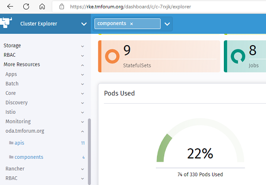
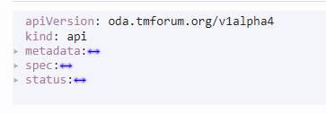

# Exploring Custom Resources Troubleshooting Guide

The Reference Implementation of the ODA Canvas is following the Kubernetes Operator pattern - this defines data entities for every resource (component, api etc.) in the Kubernetes API (which is a type of Resource Inventory). This can be very useful for troubleshooting as you can examine the status of every resource.

The status of the resources can be examined with any kubernetes tool: In the examples below we are connected to the TM Forum Open Digital Lab (ODL) and using the Rancher Cluster Explorer tool on the `oda-ca-cluster2` cluster:  https://rke.tmforum.org/dashboard/c/c-7rxjk/explorer

The custom resources are listed in the left-hand-side menu under `oda.tmforum.org`. At present, there are two custom resources for `component` and `api`, and the Reference Implementation also uses other custom resources provided by istio (`VirtualServices` and `Gateways`) and prometheus (`Service Monitors`).

Every resource in Kubernetes has 5 top-level properties (shown in the diagram below)
* The `apiVersion` for the resource.
* The `kind` of the resource.
* The `metadata` that will include a `name`, `labels` (all resources should have a `oda.tmforum.org/componentName` label with the name of the component to which they belong) and a `uid` that is the unique ID for that instance of the resource. The child resources of the component will also have a `ownerReferences` label that links that child resource to the parent resource).
* The `spec` which is the target state for the resource.
* The `status` which is updated by the software operators to reflect the current state of the resources. 

For the example API Resource, the `spec` shows the target state for this API resource (from the parent component) and the `status` shows details of the current state for the resource - for example it shows that the `implementation` of the API is ready to receive traffic, and it shows the external URL to the API (through whatever API Gateway and/or Service Mesh that is being used in the implementation).

## Troubleshooting tips

When you deploy an ODA Component, you should be able to see an `API` resource created for every API in the `core function`, `security` or `management` part of that component definition. If you cannot see these resources then the ComponentOperator is not processing that component properly: Check that you are deploying the component in a namespace that is being monitored by the Operator (`components` namespace in the ODL). Also check that the ComponentOperator is running (in the 'canvas` namespace in the ODL). Also, check the logs produced by the operator (see [Controller Logging](Controller-Logging.png) ).

If you can see the API resources, look into the `status` of the API resource: If you are not getting a `implementation: ready:true` status, then the micro-service that is implementing the API may not be responding to the Kubernetes Health-Check. Check that the micro-service is giving a HTTP 200 response to a GET request at the root of the API.

If the API is not returning the `url` where the API is being exposed, then check the API Gateway and/or Service Mesh implementation. It is also worth checking the logs produced by the operator (see [Controller Logging](Controller-Logging.png) ).

You can also use the same troubleshooting approach to navigate through the baseline Kubernetes resources and any other installed services (e.g. Istio, Prometheus) that is installed in the cluster.